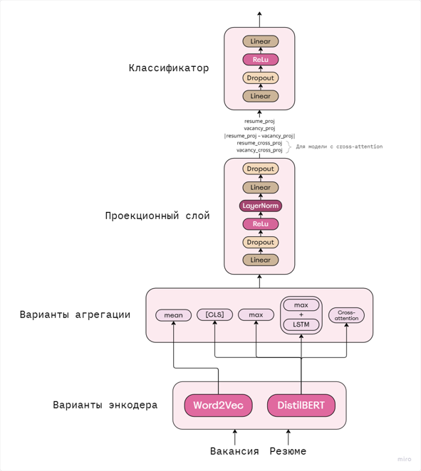
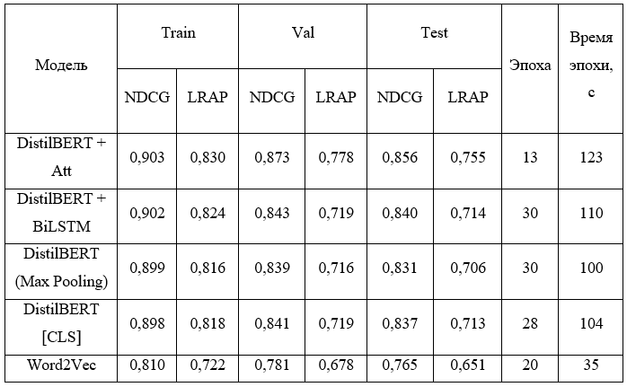
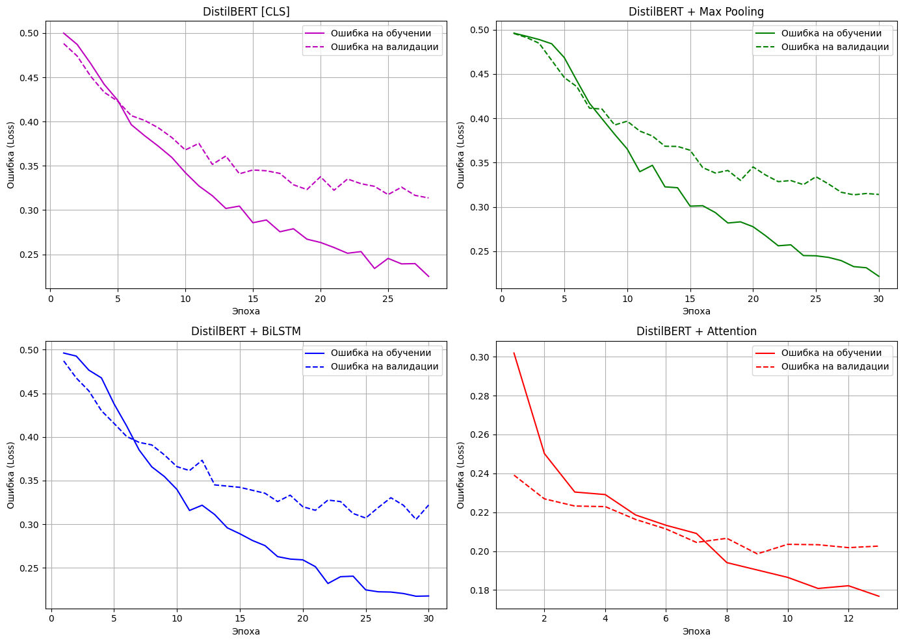
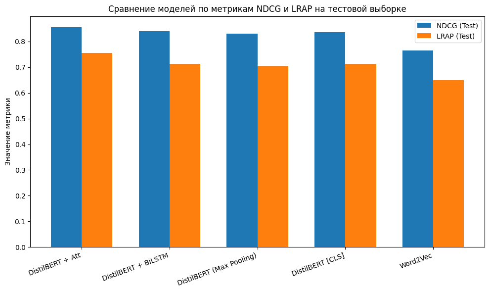
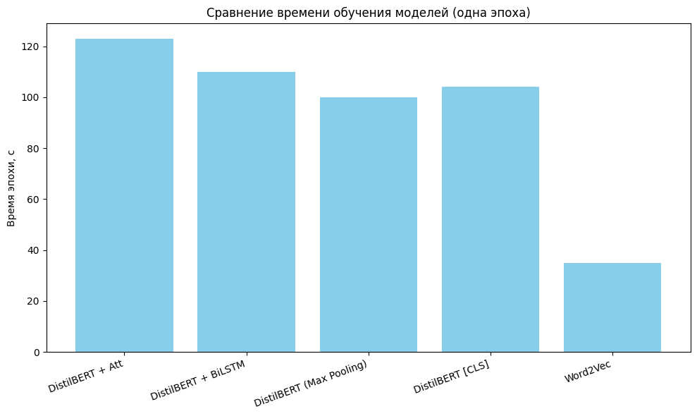
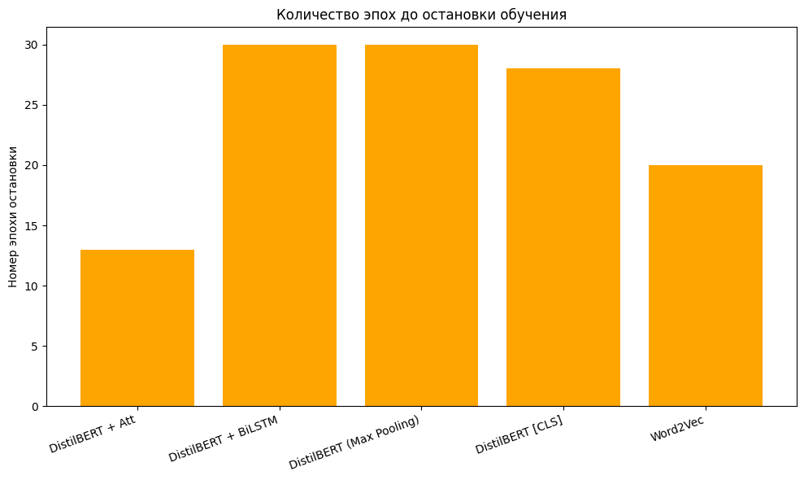

# Система интеллектуального сопоставления резюме и вакансий v. 0.1
Проект по автоматизированному сопоставлению резюме и вакансий в рамках решения задачи ранжирования

## Описание
Данный проект посвящён задаче автоматического сопоставления резюме и вакансий с применением современных методов NLP и машинного обучения. Реализованы и сравнены архитектуры нейронных сетей с различными методами агрегации (извлечение [CLS]-токена, max pooling, BiLSTM поверх слоя DistilBERT-энкодера и cross-attention), а также проведён анализ качества моделей с помощью метрик NDCG и LRAP.

### Схема исследуемых моделей

## Структура репозитория
- `notebooks/` — ноутбуки с исходным кодом всех моделей и результатами экспериментов
- `data/` — используемые входные данные (предобработанные и нет)
- `reports/` — итоговые графики, выводы и презентация

## Визуализация результатов
### Таблица сравнения моделей

### Кривые обучения

### Сравнение метрик моделей

### Сравнение времени обучения моделей в течении одной эпохи

### Сравнение эпох до остановки обучения

## Основные выводы

- Модель с DistilBERT-энкодером и механизмом внимания продемонстрировала наиболее высокие результаты с NDCG = 0,856 и LRAP = 0,755 на тестовой выборке.
- Тем не менее, данная модель демонстрирует склонность к быстрому переобучению. Максимум эффективности был достигнут уже на 13 эпохе, а разница между NDCG на валидации и тестировании составила около 2%.
- Использование max pooling вместо извлечения [CLS]-токена не привело к улучшению качества ранжирования, но дало сопоставимые результаты.
- Использование LSTM поверх BERT-энкодера позволило увеличить значение метрики NDCG, но не преодолело показатели модели с перекрестным вниманием.

## Лицензия

Проект распространяется под лицензией MIT — вы можете свободно использовать, изменять и распространять код с обязательным указанием авторства.

Подробнее см. в файле [LICENSE](LICENSE).

---

## Контакты

Автор: Максименков К.Е. 

Email: makski1984@yandex.ru
